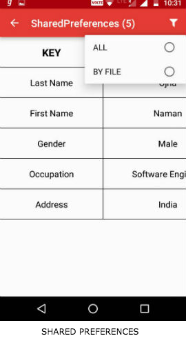
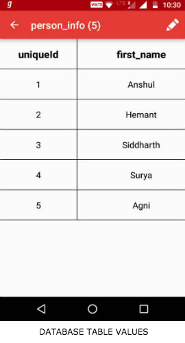
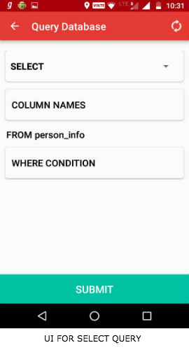
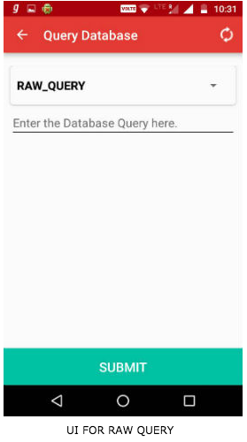
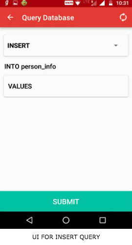

# AppDataReader

A library for reading and writing Shared Preferences and Database values of the application within the device. 

## Advantages of using this library
* No Java Code. Only gradle dependency.
* Read all the Database Values in the device without the need of a browser.
* See all the Shared Preferences at once or file by file.
* Edit the table data by clicking the value of a column in a row.
* Query the database with various types of queries like SELECT, UPDATE, DELETE, INSERT and RAW QUERY. Querying is made simpler by making an interactive UI for various types of queries.
* Copy the value of an individual column of Shared Preference and Database tables to Clipboard.
* With the help of some additional gradle code, this library will pick up the compileSdk Version, targetSdk Version and  Build Tools Version from the main project.

## Install the library
```
compile 'com.awesomedroidapps:inappstoragereader:1.0.2'
```
Or if the library is to be used only for debug builds and not release builds, then 
```
debugCompile 'com.awesomedroidapps:inappstoragereader:1.0.2'
```

The library is using some dependencies for building the UI i.e. `RecyclerView v23.2.0`, `CardView v23.2.0` and the `Support Library v23.2.0`. In case, your project is also using these dependencies, but with a different version, then declare the following variables in the `build.gradle` file of the root project.

```
project.ext {
    rvv = '23.1.0' //RecyclerView  version
    slv = '23.1.0' // Support AppCompat v7 library version.
    clv = '23.1.0' //CardView Library Version
    csv = 23 // compile Sdk version
    tsv = 23 //Target Sdk version
    btv = '23.0.2' // Build tools version.
 }
```


The library declares an activity `AppDataListActivity` with action `android.intent.action.MAIN` in the `AndroidManifest.xml`. So as soon as your application is installed, this activity will also be placed in the launcher of the phone. Search for **App Data** on the launcher.

## Demo 

Checkout the Live Demo of the application [here](https://appetize.io/app/qvfqvbvjbyvya59bacw4uwrab0)

#### View Database and Shared Preferences

&nbsp; &nbsp; &nbsp;  &nbsp; &nbsp; &nbsp;&nbsp; &nbsp; &nbsp;  &nbsp; &nbsp; &nbsp;  &nbsp; &nbsp; &nbsp;  &nbsp; &nbsp; &nbsp; &nbsp; &nbsp; &nbsp;  &nbsp; &nbsp; &nbsp;


#### Query The Database

 &nbsp; &nbsp; &nbsp;  &nbsp; &nbsp; &nbsp; 

***


## Tentative features for the next release

* Copy an entire row to Clipboard.
* Export an entire table in csv and json format.

=====

**Checkout my other projects**

[RxDownloader](https://github.com/Ansh1234/RxDownloader)- Demo of Downloading Songs/Images through Android Download Manager using RxJava2

[RxFbLiveVideoEmoticons](https://github.com/Ansh1234/RxFbLiveVideoEmoticons) - Demo of Fb Live Video Reactions using RxJava2. 

[WebViewDemo](https://github.com/Ansh1234/WebViewDemo) - A demo project for showing how to use WebViews in Android.


