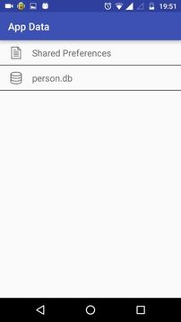

# AppDataReader

A library for reading Shared Preferences and Database within the application. 


## Install the library
```
compile 'com.awesomedroidapps:inappstoragereader:1.0.0-beta'
```
Or if the library is to be used only for debug builds and not release builds, then 
```
debugCompile 'com.awesomedroidapps:inappstoragereader:1.0.0-beta'
```

The library is using two dependencies for building the UI i.e. `RecyclerView v23.2.0` and the `Support Library v23.2.0`. In case, your project is also using these dependencies, but with a different version, then declare the following variables in the `build.gradle` file of the root project.

```
project.ext {
    rvv = '23.1.0' //RecyclerView  version
    slv = '23.1.0' // Support AppCompat v7 library version.
    csv = 23 // compile Sdk version
    tsv = 23 //Target Sdk version
    btv = '23.0.2' // Build tools version.
 }
```


The library declares an activity `AppDataListActivity` with action `android.intent.action.MAIN` in the `AndroidManifest.xml`. So as soon as your application is installed, this activity will also be placed in the launcher of the phone. Search for **App Data** on the launcher.  


